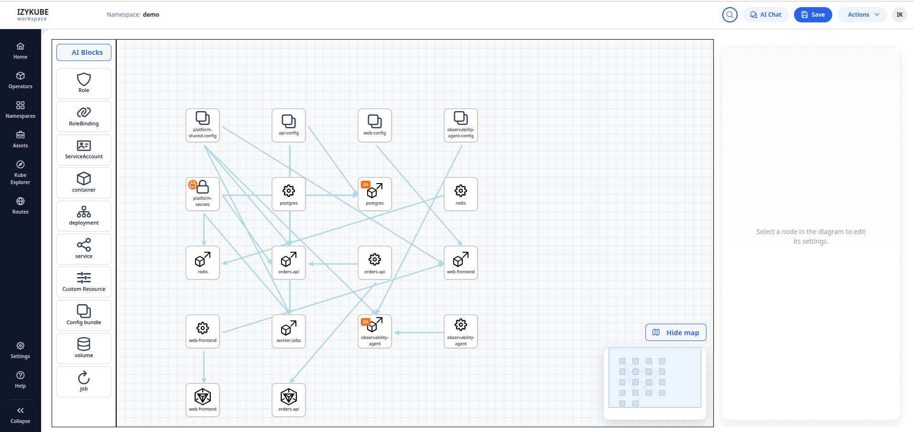

<!--
  IzyKube
  Copyright (c) 2026-present Izylife Solutions s.r.l.
  Author: Giuseppe Cassata

  This program is free software: you can redistribute it and/or modify
  it under the terms of the GNU Affero General Public License as published
  by the Free Software Foundation, either version 3 of the License,
  or (at your option) any later version.

  This program is distributed in the hope that it will be useful,
  but WITHOUT ANY WARRANTY; without even the implied warranty of
  MERCHANTABILITY or FITNESS FOR A PARTICULAR PURPOSE. See the
  GNU Affero General Public License for more details.

  You should have received a copy of the GNU Affero General Public License
  along with this program. If not, see <https://www.gnu.org/licenses/>.
-->

# IzyKube

IzyKube is a Kubernetes architecture designer for modeling Kubernetes namespaces, generating manifests, and applying them to a target cluster.
The UI is diagram-based and uses `interact.js` + SVG for node/link editing.



## Scope

IzyKube supports:

- namespace modeling with version snapshots
- visual editing of workloads and related resources
- template generation and deployment/undeployment
- runtime inspection from Kubernetes
- optional YAML import/export and Helm export

## Technology Stack

- Frontend: Angular
- Backend: Spring Boot
- Persistence: MongoDB
- Cluster API: Kubernetes (Fabric8 client)
- Diagram interactions: interact.js

## Repository Layout

- `frontend/`: Angular client
- `backend/`: Spring Boot API and orchestration logic
- `yaml/`: Kubernetes manifests used by setup flows
- `docs/`: project documentation
- `Dockerfile`: multi-stage build — Maven compiles frontend + backend into a single self-contained jar; JRE runtime image
- `docker-compose.yml`: full local stack (MongoDB, Docker registry, k3s, Ollama, izykube)
- `.github/workflows/`: CI and release pipelines
- `Makefile`: cluster addon bootstrap commands

## Prerequisites

- Java 21 (for local frontend dev only)
- Node.js 18+ / npm (for local frontend dev only)
- Docker (with Compose v2)
- Python 3.10+
- kubectl
- helm
- openssl

## Docker Image

Pre-built images are published to DockerHub at [`gcassata/izykube`](https://hub.docker.com/r/gcassata/izykube):

| Tag | Published by |
|---|---|
| `latest` | Every merge to `main` (after CI passes) |
| `<sha>` | Same push, short commit SHA |
| `1.2.3`, `1.2` | Every `v*` tag / GitHub release |

To run without building locally:

```bash
docker pull gcassata/izykube:latest
```

## Local Development

### Start the full stack

```bash
docker compose up
```

This builds the izykube image and starts MongoDB, registry, k3s, Ollama, and the app on `http://localhost:8090`.

### Start frontend in dev mode (hot-reload)

```bash
make run-angular-client
```

### Optional: open a dev browser profile

```bash
make run-chrome-dev
```

## Build Commands

### Frontend only

```bash
npm -C frontend install --legacy-peer-deps
npm -C frontend run build -- --configuration production
```

## Install From Scratch (zero to running)

### 1) Clone

```bash
git clone https://github.com/izylife/izykube.git
cd izykube
```

### 2) Start the stack

```bash
docker compose up
```

MongoDB, registry, k3s, Ollama, and izykube start together. The first run builds the image (Maven + frontend).

### 3) Install cluster addons into k3s

Once k3s is healthy (`docker compose ps` shows `izykube-k3s` healthy), point kubectl at the compose kubeconfig and install addons:

```bash
export KUBECONFIG=$(docker volume inspect izykube_kubeconfig --format '{{.Mountpoint}}')/config
make install-cluster-addons
```

This installs OLM, cert-manager, internal CA, Istio + gateway, Prometheus, and Grafana.

If you want the one-shot flow (addons + Ollama model pull), run:

```bash
make install
```

`make install` asks interactively for the Ollama model (default comes from `backend/src/main/resources/application.yaml`).

For the interactive installer with progress bar and retry/resume support, run:

```bash
make install
```

`make install` uses a PySide6 GUI (installed via `requirements.txt`).

### 4) Trust internal CA on your local machine (recommended for HTTPS routes)

Run in an interactive terminal (sudo password may be required):

```bash
sudo -v && make install-ca-local
```

### 5) Optional: open dedicated browser profile

```bash
make run-chrome-dev
```

## CI/CD

### CI (`ci.yml`) — triggers on pull request and push to `main`

| Job | What it does |
|---|---|
| `backend` | Runs tests, packages jar, uploads artifact |
| `frontend` | Installs deps, runs headless unit tests, production build, uploads dist |
| `quality-gates` | Checks no hardcoded warn toasts, no `stringData` in manifest generator |
| `docker-publish` | Builds Docker image and pushes `gcassata/izykube:latest` + `:<sha>` — only on push to `main`, after all three jobs pass |

### Release (`release.yml`) — triggers on `v*` tags

Builds backend + frontend, creates a GitHub release with jar / frontend tarball / SHA256 checksums, then builds and pushes `gcassata/izykube:<version>`, `:<major.minor>`, and `:latest` to DockerHub.

### GitHub environment

Both Docker publish jobs use the `izykube` GitHub environment. Required secrets:

| Secret | Value |
|---|---|
| `DOCKERHUB_USERNAME` | `gcassata` |
| `DOCKERHUB_TOKEN` | DockerHub personal access token |

## Optional Services

### Grafana port-forward from Makefile

```bash
make grafana-port-forward
```

This forwards Grafana to `http://localhost:3000`.

### Uninstall cluster addons

```bash
make uninstall
```

`make uninstall` opens the same PySide6 GUI flow and removes addons installed by the installer (`OLM`, `cert-manager`, `Istio`, `Prometheus`, `Grafana`, internal gateway/CA resources).

## Functional Notes

### Diagram link conventions

- `Ingress -> Service -> Deployment`
- `Service -> Deployment`
- `ConfigMap/Secret/Volume -> Deployment`
- `Job -> Deployment` or `Job -> Container` (when modeled that way)

### Namespace versions

- versions are stored and listed per namespace
- each row can be opened in diagram view
- rows can be deleted from the versions grid

## Makefile Reference

Main tasks with target dependencies and behavior:

| Command | Depends on (Make targets) | What it does |
|---|---|---|
| `make run-angular-client` | `-` | Kills process on port `4200` (if any) and starts Angular dev server from `frontend/`. |
| `make run-chrome-dev` | `-` | Opens Chrome with a dedicated insecure dev profile for local UI testing. |
| `make install` | `install-python-deps` | Runs Python GUI installer (`scripts/installer.py install`) with progress bar, live logs, retry, and resume support. |
| `make uninstall` | `install-python-deps` | Runs Python GUI uninstaller (`scripts/installer.py uninstall`) with progress bar and live logs. |
| `make install-istio` | `-` | Installs Istio (downloads `istioctl` if missing), enables sidecar injection on `default` namespace. |
| `make create-internal-ca` | `install-cert-manager` | Generates internal CA cert/key, creates `izykube-ca` TLS secret, applies ClusterIssuer manifest. |
| `make install-ca-local` | `create-internal-ca` | Installs cluster CA certificate in local OS trust store (`/usr/local/share/ca-certificates`). |
| `make grafana-port-forward` | `install-grafana-release` | Starts background port-forward to Grafana service on `http://localhost:3000`. |
| `make install-cluster-addons` | `install-olm`, `create-internal-ca`, `install-istio-gateway`, `install-prometheus`, `install-grafana` | Installs core platform addons: OLM, cert-manager/CA, Istio gateway, Prometheus, Grafana. |
| `make run-i18n-extract` | `-` | Extracts Angular i18n messages into `frontend/src/locale`. |
| `make run-i18n-build LOCALE=xx` | `-` | Builds Angular app using the selected i18n configuration (`LOCALE`, default `en`). |
| `make run-i18n-serve LOCALE=xx` | `-` | Serves Angular app using the selected i18n configuration (`LOCALE`, default `en`). |

## Contributing

See [CONTRIBUTING.md](CONTRIBUTING.md).

For code changes, use small PRs with:

- clear problem statement
- scope-limited diff
- build/test evidence

## License

This project is licensed under the GNU Affero General Public License v3.0 or later (AGPL-3.0-or-later). See [LICENSE.md](LICENSE.md).
