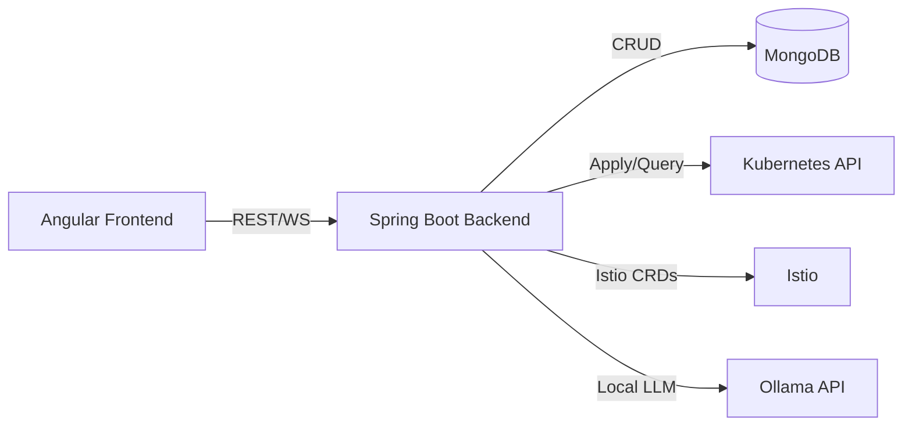
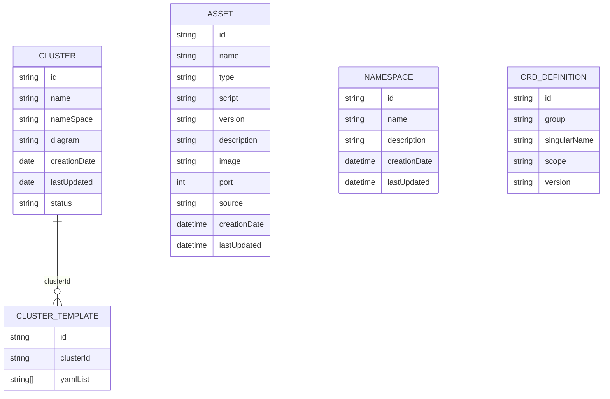
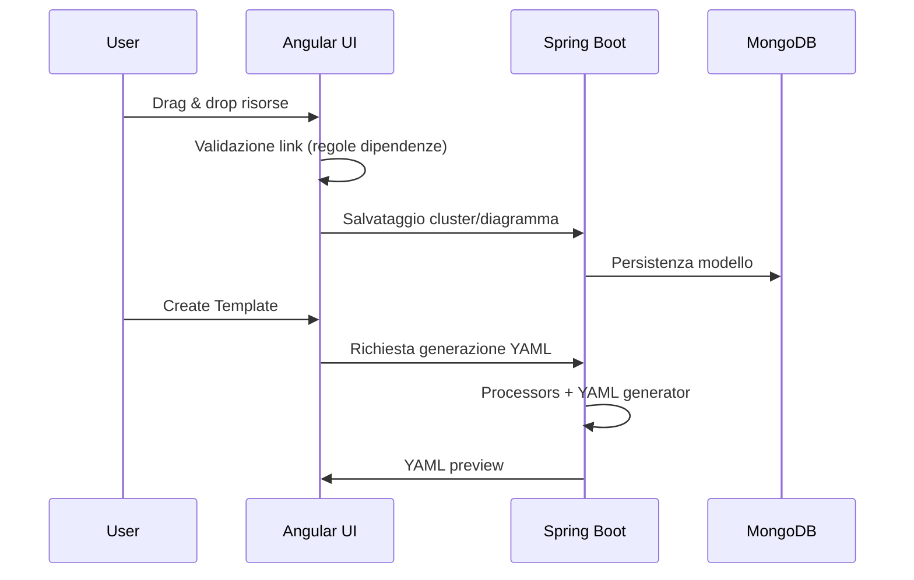
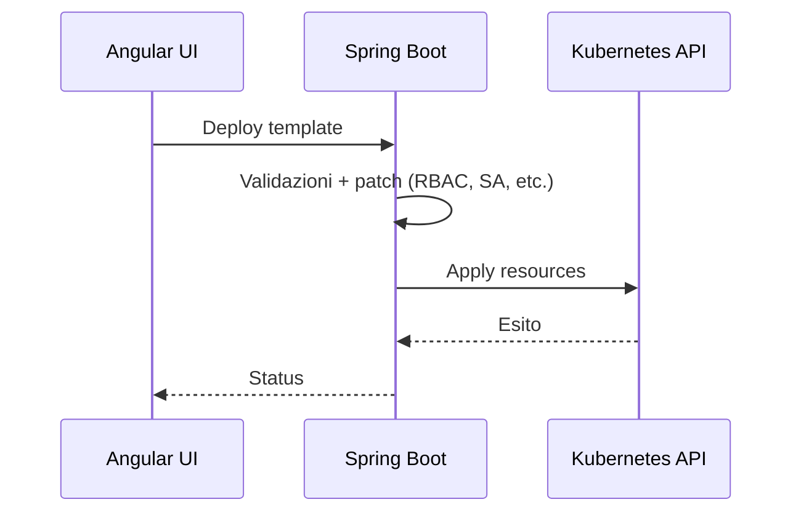
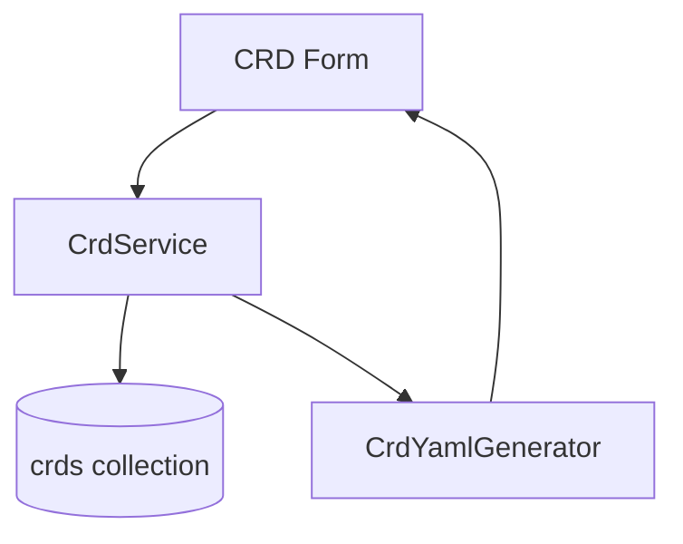

# IzyKube - Stato dell'arte

## Scope
Questo documento riassume lo stato attuale del progetto IzyKube nel repo `izykube`, con focus su architettura, componenti, flussi principali e punti di integrazione.

## Architettura generale

### Componenti principali
- **Frontend (Angular)**: UI per diagrammi, form di configurazione, preview YAML, gestione CRD, explorer Kubernetes.
- **Backend (Spring Boot)**: API REST, WebSocket, generazione YAML, integrazione Kubernetes, gestione asset e template.
- **Database (MongoDB)**: persistenza di cluster template, CRD, asset, namespace.
- **Integrazioni**: Kubernetes API (Fabric8), Istio, RBAC, AI locale (Ollama).

### Diagramma high-level

## Moduli e responsabilita

### Frontend (Angular)
- **Diagram editor**: costruzione risorse con drag-and-drop e linking (GoJS).
- **Form editor**: configurazione dettagliata per risorsa (Deployment, Service, Ingress, ConfigMap, Secret, Volume, Job, Istio).
- **CRD editor**: form strutturato con preview YAML read-only.
- **Kube explorer**: visualizzazione e gestione risorse cluster.
- **Pod shell**: terminale WebSocket su pod.
- **i18n**: estrazione e build multi-lingua.

File/aree chiave:
- `frontend/src/app/diagram/*`
- `frontend/src/app/cluster/*`
- `frontend/src/app/crds/*`
- `frontend/src/app/kube-explorer/*`
- `frontend/src/app/services/*`

### Backend (Spring Boot)
- **Controllers**: API REST per cluster, assets, CRD, template, explorer, AI, PV, namespace.
- **Services**: generazione YAML, orchestrazione risorse, RBAC planner, AI integration, client Kubernetes.
- **WebSocket**: pod shell.
- **Migrations**: Mongock changelogs.
- **Serving UI**: build frontend con Maven e copia `frontend/dist/frontend` in `static/` per serving via Spring Boot.

File/aree chiave:
- `backend/src/main/java/com/izylife/izykube/web/*`
- `backend/src/main/java/com/izylife/izykube/services/*`
- `backend/src/main/java/com/izylife/izykube/services/processors/*`
- `backend/src/main/java/com/izylife/izykube/services/rbac/*`

## API surface (REST + WebSocket)

### REST (principali)
- **Cluster** `backend/src/main/java/com/izylife/izykube/web/ClusterController.java`
  - `POST /api/cluster` create
  - `PUT /api/cluster/{id}` update
  - `PATCH /api/cluster/{id}` patch parziale
  - `GET /api/cluster/all` list
  - `GET /api/cluster/{id}` get by id
  - `DELETE /api/cluster/{id}` delete
  - `POST /api/cluster/{id}/deploy` deploy
  - `DELETE /api/cluster/{id}/undeploy` undeploy
- **Template** `backend/src/main/java/com/izylife/izykube/web/TemplateController.java`
  - `POST /api/template/{id}` create template
  - `PUT /api/template/{id}` update template
  - `DELETE /api/template/{id}` delete template
- **CRD** `backend/src/main/java/com/izylife/izykube/web/CrdController.java`
  - `GET /api/crds` list
  - `GET /api/crds/{id}` get
  - `GET /api/crds/{id}/yaml` YAML preview
  - `POST /api/crds` create
  - `PUT /api/crds/{id}` update
  - `DELETE /api/crds/{id}` delete
- **Assets** `backend/src/main/java/com/izylife/izykube/web/AssetController.java`, `backend/src/main/java/com/izylife/izykube/web/AssetsController.java`
  - `GET /api/assets` list (optional `type=controller`)
  - `GET /api/asset/all` list all
  - `GET /api/asset/{id}` get
  - `POST /api/asset` create
  - `PUT /api/asset/{id}` update
  - `DELETE /api/asset/{id}` delete
- **Image assets** `backend/src/main/java/com/izylife/izykube/web/ImageAssetController.java`
  - `GET /api/image-assets` list (optional `search`)
  - `POST /api/image-assets` create
- **Namespaces** `backend/src/main/java/com/izylife/izykube/web/NamespaceController.java`
  - `GET /api/namespaces` list
  - `POST /api/namespaces` create
  - `POST /api/namespaces/{identifier}/resources/{resourceId}/restart` restart workload
- **Persistent volumes** `backend/src/main/java/com/izylife/izykube/web/PersistentVolumeController.java`
  - `GET /api/persistent-volumes` list
  - `GET /api/persistent-volumes/{name}` get
  - `POST /api/persistent-volumes` create
  - `PUT /api/persistent-volumes/{name}` update
  - `DELETE /api/persistent-volumes/{name}` delete
- **Kube explorer** `backend/src/main/java/com/izylife/izykube/web/KubernetesExplorerController.java`
  - `GET /api/kube/namespaces`
  - `GET /api/kube/summary?namespace=...`
  - `GET /api/kube/logs/pod?namespace=...&name=...&tail=...`
  - `GET /api/kube/pods/{namespace}/{podName}`
  - `GET /api/kube/pods/{namespace}/{podName}/logs?container=...&tail=...`
  - `GET /api/kube/pods/{namespace}/{podName}/events`
  - `GET /api/kube/logs/deployment?namespace=...&name=...&tail=...`
  - `GET /api/kube/deployments/{deployment}/pods?namespace=...`
- **Kubernetes Core V1 proxy** `backend/src/main/java/com/izylife/izykube/web/KubernetesCoreV1ProxyController.java`
  - `GET /api/v1/namespaces/{namespace}/pods/{podName}`
  - `GET /api/v1/namespaces/{namespace}/pods/{podName}/log?container=...&tailLines=...`
  - `GET /api/v1/namespaces/{namespace}/events?fieldSelector=...`
- **AI** `backend/src/main/java/com/izylife/izykube/web/AiController.java`
  - `POST /api/ai/generate`
  - `POST /api/ai/import-yaml`
  - `POST /api/ai/export-yaml` (return YAML or Helm chart ZIP)
  - `POST /api/ai/chat`
- **SPA fallback** `backend/src/main/java/com/izylife/izykube/web/SpaForwardingController.java`, `backend/src/main/java/com/izylife/izykube/web/FallBackController.java`
  - Forwarding alle route UI per supportare deep links.

### WebSocket
- **Pod shell** `backend/src/main/java/com/izylife/izykube/configuration/WebSocketConfig.java`
  - `ws://<host>/ws/pod-shell`
  - Allowed origins: `*`

## Data model (MongoDB)

### Collezioni principali
- `cluster`: modello del diagramma (nodes/links) e metadati.
- `clusterTemplates`: YAML generati per cluster.
- `assets`: asset utente o predefiniti (container, script, etc.).
- `namespaces`: metadata namespace.
- `crds`: definizioni CRD modello-based.

### Schema ad alto livello (Mermaid ER)

### Note sul modello cluster
- Il cluster persiste grafo **nodes/links** basato su `NodeDTO` e `LinkDTO`.
- Gli array `nodes` e `links` rappresentano i componenti K8s e le dipendenze del diagramma.

## Flussi principali

### 1) Costruzione diagramma e template

### 2) Deploy su Kubernetes

### 3) CRD editor
- Model-based editor (no YAML editor).
- Derivazione automatica di `plural`, `kind`, `metadata.name`.
- Generazione YAML via `CrdYamlGenerator`.

## Integrazioni specifiche

### RBAC Access Policy
- UI supporta target su workload.
- Backend genera ServiceAccount, Role, RoleBinding e patcha workload.

Riferimento: `docs/rbac-access-policy-examples.md`.

### AI locale (Ollama)
- Backend usa `ai.local.base-url` e `ai.local.model`.
- Supporto per assistenza configurazioni e diagrammi.
- Timeout configurabili: `ai.local.connect-timeout-ms`, `ai.local.read-timeout-ms`.

Riferimento: `backend/src/main/resources/application.yaml`.

### Istio
- Client e modello v1beta1 inclusi.
- Risorse Istio gestite nei processors e nelle form dedicate.

## Security e accesso
- Spring Security abilitato con sessione stateless e CSRF disabilitato.
- Attuale configurazione consente accesso pubblico a `/api/**`, `/api-docs/**`, `/swagger-ui/**` e `/ws/**`.
- CORS configurato via `app.cors.allowed-origin-patterns` in `application.yaml`.

## Demo app
- `demo_app/` contiene una mini app Express per testare la connettivita MySQL via Service DNS.
- Endpoint `/test-connection` usa variabili `DB_HOST`, `DB_PORT`, `DB_NAME`, `DB_USER`, `DB_PASSWORD`.

## Configurazione e build

### Backend
- Java 21, Spring Boot 3.2.
- Maven build con plugin `frontend-maven-plugin` per build UI.
- Config default: `server.port=8090`, MongoDB `mongodb://localhost:27017/izykube`.
- Swagger UI: `/swagger-ui.html`, OpenAPI JSON: `/api-docs`.
- CORS permissivo per origini locali in `application.yaml`.

### Frontend
- Angular 16, PrimeNG, GoJS.
- Start dev con `ng serve` e proxy config.

### Dev helpers
- `Makefile` per avvio servizi, i18n, k3d/istio, ollama.

## Stato test
- Unit test Java presenti nei servizi e controllers.
- Cypress e2e configurato nel frontend (presenti screenshots di failure).

## Gaps e aree da approfondire
- Coverage test e2e: verificare stato reale e stabilita suite.
- Osservabilita runtime: non evidente stack di metrics/logging.
- Hardening security: CORS molto permissivo in locale; verificare config per ambienti reali.

## Prossimi passi suggeriti
- Aggiornare una mappa dei flussi reali con input/output delle API.
- Definire un documento di deployment ambienti (dev/stage/prod).
- Consolidare stato test e pipeline CI.
